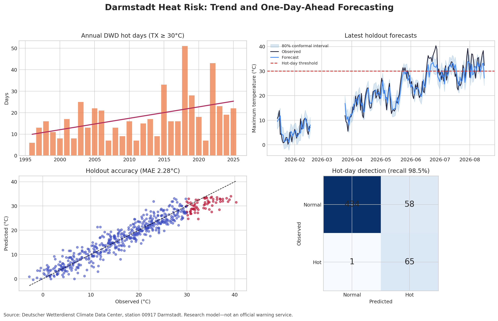

# Rhine–Main Heat Risk Forecasting

**Project period: May 2026 – August 2026**

[](https://github.com/MUmairSarwar/germany-heat-risk-forecasting/actions/workflows/ci.yml)
[](https://www.python.org/)
[](LICENSE)

A reproducible data-science project that predicts next-day heat risk in Darmstadt, Germany, using official Deutscher Wetterdienst (DWD) observations. The project combines time-series feature engineering, model comparison, rare-event classification, split-conformal uncertainty intervals and robust trend analysis.



## Highlights

- Built a strict chronological train/validation/holdout pipeline using DWD data.
- Improved maximum-temperature forecast MAE by **10.3%** over a persistence baseline.
- Achieved **98.5% hot-day recall** on unseen 2025+ holdout data.
- Quantified uncertainty using split-conformal prediction intervals.
- Analysed long-term change with Theil–Sen trend estimation.
- Added automated tests, model/data cards and reproducible outputs.

## Current checked-in results

The checked-in experiment uses observations through **2026-08-16** and a strict 2025+ holdout containing 558 days and 66 hot days.

| Holdout result | Value |
|---|---:|
| Selected model | Histogram gradient boosting |
| Maximum-temperature MAE | 2.28°C |
| Improvement over persistence | 10.3% |
| Hot-day recall | 98.5% |
| Hot-day precision | 52.8% |
| Hot-day PR AUC | 0.767 |
| Nominal 80% interval coverage | 71.1% |
| Robust hot-day trend | +0.42 days/year |

The 71.1% holdout interval coverage is below the nominal 80% target. That limitation is kept visible because operational calibration would need monitoring or rolling updates under weather and climate drift.

## Reproduce

```bash
python -m venv .venv
source .venv/bin/activate
python -m pip install -e .
heat-risk run
```

## Repository structure

```text
src/heatrisk/        tested Python package
tests/               unit tests for data, leakage and calibration
docs/                methodology, model card and data card
outputs/             generated metrics, predictions and dashboard
.github/workflows/   CI pipeline
```

## Technologies

Python, pandas, scikit-learn, time-series analysis, uncertainty analysis, model evaluation, data visualisation and DWD climate data.

## Data and attribution

Source: **Deutscher Wetterdienst (DWD), Climate Data Center**, station 00917 Darmstadt. This repository is a research project and not an official DWD warning service.

## Other selected projects

- [Strategic Classification](https://github.com/MUmairSarwar/strategic-classification-toy)
- [Robust Federated Learning](https://github.com/MUmairSarwar/robust-federated-learning-ml-security)
- [Retail Customer & Operations Analytics](https://github.com/MUmairSarwar/retail-customer-analytics)
- [Telecom Customer Churn Prediction](https://github.com/MUmairSarwar/customer-churn-prediction)

## Author

**Muhammad Umair Sarwar**  
M.Sc. Mathematics student (Mathematics in Data Science), TU Darmstadt.  
Open to PhD positions and full-time roles.

